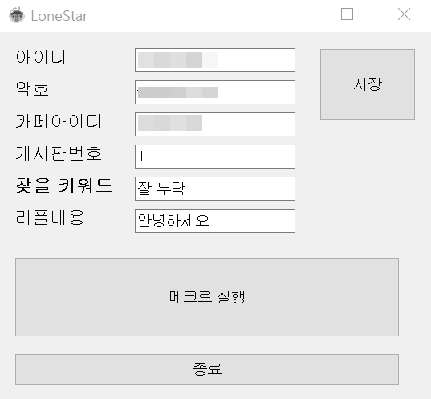

# 네이버 카페 특정 글 올라오면 리플 달기

 

위 사진을 클릭하면 소개영상으로 이동합니다. (https://youtu.be/-7i6Ov0NDbg?t=0s)

코드는 어뷰징 문제가 있어서 여기에 올리지 않습니다. 

네이버 카페의 특정 게시판에서 제목이 일부 포함된 글이 올라오면 자동으로 댓글을 다는 프로그램입니다.

만든 이유 : 아내가 요청해서

# 특징

 - 네이버 자동로그인
 - 동적으로 카페 아이디를 이용해서 이동도 가능하지만 이건 일부러 안만듬
 - 특정 카페의 글 메뉴를 동적으로 사용가능
 - 1번째 글만 검사해서 키워드 내용이 포함된 제목이 올라오면 바로 코멘트 담
 - 코멘트 다는게 글을 이동해서 다는게 아닌 바로 접근. 
 - 윈도우 모드
 - 데이터 저장(암호화 안됨)
  
  
# 설치 파일 명령어

pyinstaller loneStar.py
  
